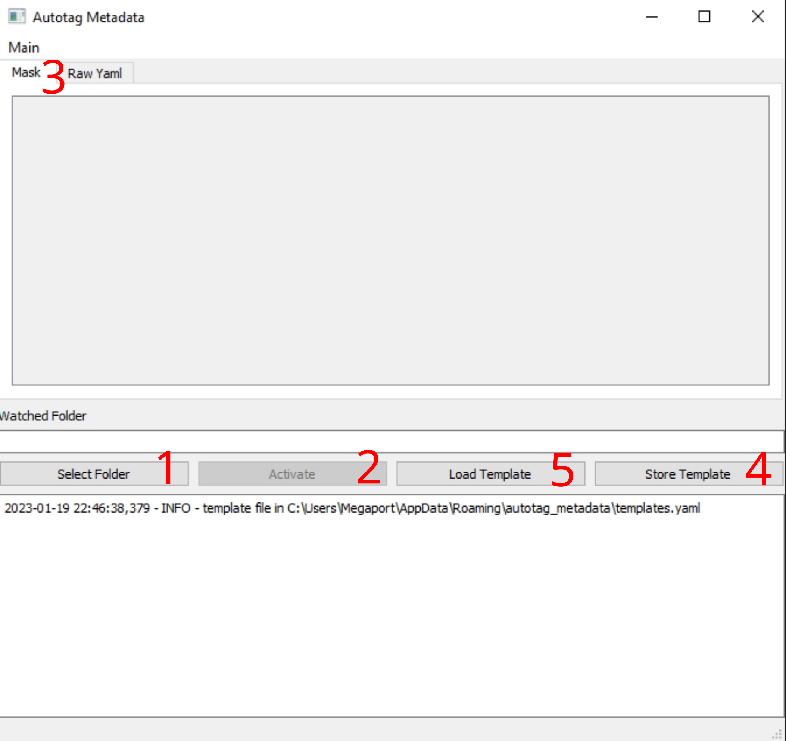

---
jupytext:
  formats: ipynb,md:myst
  text_representation:
    extension: .md
    format_name: myst
    format_version: 0.13
    jupytext_version: 1.13.8
kernelspec:
  display_name: Python 3 (ipykernel)
  language: python
  name: python3
---

User manual
===========

The following figure shows the GUI of autotag-metadata.



1. Folder Selection

First select a folder that you whish to observe for file creation.

2. Activate/Deactivate

The folder will only be observed when the program is activated. It can also be tuned off any time.

3. metadata input

When the program is started the mask is empty and metadata must be added in the `Raw Yaml` tab. such as:

```
user: John
experiment: 10
```
When the input is not valid [YAML](https://en.wikipedia.org/wiki/YAML), the background color will change to purple.

Elaborate examples on how a YAML file could look like, can be found in the example section of [echemdbs' metadata-schema](https://github.com/echemdb/metadata-schema/tree/main/examples).

Once you are satisfied with your input metadata, you can also edit the fields in the `Mask` tab.

4. Create template

If you intend to use the input metadata multiple times, you can store the current state into a template.

5. Load template

Load a template from a previous session.
